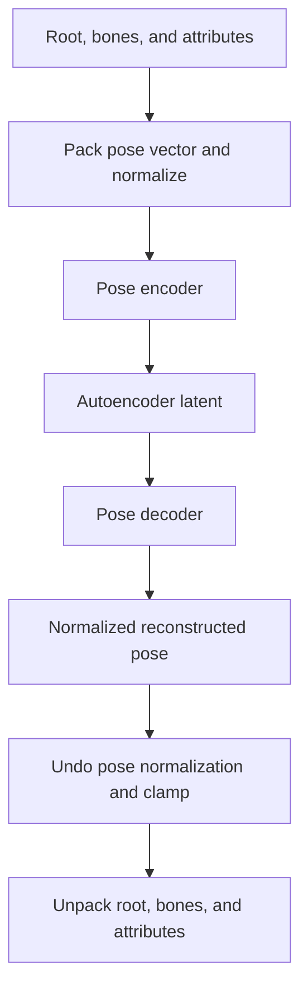

# Autoencoder: inference and training

English | [中文](train-autoencoder-workflow.zh-CN.md)

The autoencoder compresses a full pose into a latent vector and reconstructs a pose from that vector. Train it before the [controller](train-controller-workflow.md): controller training uses its encoder to prepare the pose dataset, and runtime generation uses its decoder to produce animation.

Let `P` be the pose-vector size, `D` the latent size, and `B` the batch size. Pose vectors pack the root, bone, and attribute channels selected by the asset into a fixed layout.

## Network inputs and outputs

| Network | Input and its source | Output and its use |
| --- | --- | --- |
| Pose encoder | `[B, P]` normalized pose vectors extracted from database frames during training, or from the initialization pose at runtime | `[B, D]` latents bounded by a final `Tanh`; passed to the decoder for reconstruction or normalized for controller use |
| Pose decoder | `[B, D]` encoder outputs during autoencoder training, or controller-generated latents after undoing controller normalization | `[B, P]` reconstructed normalized pose vectors; compared against training poses or converted back to animation |

Both networks are feed-forward MLPs that process one pose at a time. Adjacent frames provide temporal supervision during training, but a network input is a single pose, not a sequence.

## Inference: encode and reconstruct a pose



To encode a pose, use the asset's bone selection, attribute layout, and stored normalization. UE packs pose data with `ToPoseVectors`, clamps it when initializing controller state, applies `NormalizePoseVectors`, and evaluates the encoder.

To decode, evaluate the decoder, apply `DenormalizePoseVectors`, clamp the result, and call `FromPoseVectors`. Runtime unpacking also receives the component location and rotation needed to interpret the pose in its reference frame. The animation node publishes bones, root motion, and configured attribute outputs from this pose data.

Two normalization boundaries matter:

- **Autoencoder pose normalization** uses the asset's `PoseVectorOffset` and `PoseVectorScale`. Apply it before the encoder and undo it after the decoder.
- **Controller latent normalization** transforms encoder outputs into the controller's working space. Undo it before feeding a controller-generated latent into the decoder.

The decoder contains a final affine layer fitted to statistics of the already normalized training poses. Its output is still in normalized pose-vector space; that layer does not replace the asset's inverse pose normalization.

In the controller animation node, the pose encoder initializes the latent when pose state resets, using available pose history or asset defaults. Normal generation maintains the current latent directly and decodes it on each update; it does not re-encode every decoded pose.

## Training: prepare the dataset in UE

1. Select database frame ranges and the bones and attributes to encode.
2. Extract the selected frames into flat pose vectors.
3. Fit and store pose normalization, then normalize the vectors in place.
4. Compute per-coordinate reconstruction weights from the pose weighting settings.
5. Build the encoder and decoder in C++. The encoder ends in `Tanh`; the decoder ends in the fitted affine layer described above.
6. Write the data and initial network snapshots into shared memory and launch `train_autoencoder.py <config.json>`.

| Shared-memory field | Shape / type | Source and purpose |
| --- | --- | --- |
| `PoseVectorsGuid` | `[TotalFrameNum, P]`, `float32` | Normalized database poses; encoder inputs and reconstruction targets |
| `PoseVectorWeightsGuid` | `[P]`, `float32` | C++-computed coordinate weights for pose and motion reconstruction losses |
| `RangeStartsGuid` | `[RangeNum]`, `int32` | Each animation range's start in the pose array |
| `RangeLengthsGuid` | `[RangeNum]`, `int32` | Range lengths, used to prevent pairs crossing boundaries |
| `EncoderGuid`, `DecoderGuid` | Separate `uint8` snapshots | Initial network architecture and parameters; also buffers for returning trained networks |

JSON supplies shared-memory identifiers, dimensions, and training settings. Python opens existing memory with `SharedMemory(..., create=False)` and creates NumPy views with `np.frombuffer`. It copies the full pose array into pinned CPU memory and transfers sampled batches to the training device. UE prepares the dataset before launch rather than sending batches during training.

## Training: forward pass and targets

Python loads the supplied networks and freezes the decoder's final affine statistics. It enumerates every adjacent two-frame window within each range and randomly samples `B` windows per iteration.

```text
Database pose pair x       [B, 2, P]
    -> flatten time        [2B, P]
    -> pose encoder        [2B, D]
    -> pose decoder        [2B, P]
    -> restore time        [B, 2, P]
Reconstructed pair x_hat
```

The decoder's target is the original normalized pose pair. There are no supplied latent labels: the encoder learns through reconstruction and latent regularization.

Let `z` be the encoded pair, `w` the coordinate weights, and `delta(v) = (v[:, 1] - v[:, 0]) / DeltaTime`.

| Loss | Calculation | Target source |
| --- | --- | --- |
| Pose reconstruction | `0.2 * mean(w * abs(x - x_hat))` | Original database poses |
| Motion reconstruction | `0.01 * mean(w * abs(delta(x) - delta(x_hat)))` | Change between adjacent database poses |
| Latent magnitude | `0.001 * mean(abs(z))` | Regularization encouraging small latent values |
| Latent smoothness | `0.001 * mean(abs(delta(z)))` | Regularization encouraging similar latents for adjacent frames |

Each iteration sums these losses and updates both networks jointly with AdamW. The learning rate warms up and decays across the configured iteration budget. Temporal losses encourage smooth motion while keeping inference a single-pose operation.

## Training outputs

Python periodically writes encoder and decoder snapshots to shared memory and raises ready flags. UE loads each snapshot and clears its flag before the next publication. Final snapshots are also published when training ends.

The trained asset retains the encoder, decoder, pose layout, and normalization required for inference. Controller training then evaluates this encoder over database poses to create its latent-pose dataset. Both autoencoder networks remain fixed throughout controller training.
