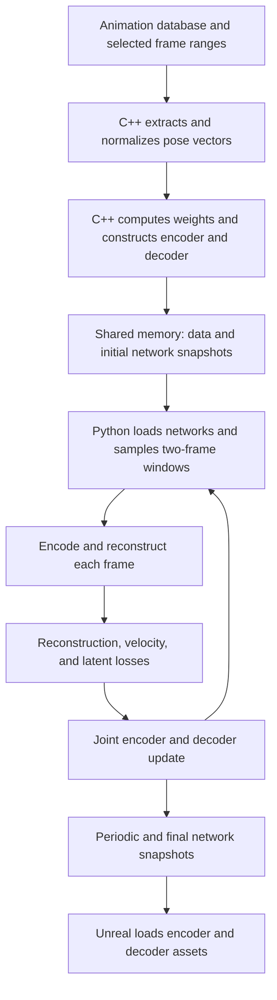

# Native AnimGen Autoencoder: Network and Training Flow

This document describes the original `train_autoencoder.py` and the C++ code that prepares its data and networks. It is based on Unreal Engine source revision `a899359c3efbaf38e491a7537148602cefde8e70`, inspected on 2026-09-11. It describes native behavior, not the proposed remote trainer. This is a source review, not an end-to-end training compatibility result.

The autoencoder learns a compact, bounded representation of individual poses. The encoder compresses a pose; the decoder reconstructs it. Training uses adjacent frames so that reconstruction preserves motion and the latent representation changes smoothly. The resulting encoder supplies the pose representations used by [controller training](train-controller-workflow.md).

## 1. End-to-end flow



Unreal launches `train_autoencoder.py <config.json>`. The JSON contains dimensions, training settings, and shared-memory identifiers; the large arrays and serialized networks are in shared memory. Python loads the supplied architecture through `NeuralNetwork` and `load_snapshot`; it does not choose the encoder or decoder topology itself.

## 2. Data and normalization

Let `P = PoseVectorSize`, `D = EncodingSize`, `B = BatchSize`, and `dt = DeltaTime`.

| Input | Shape | Meaning |
| --- | --- | --- |
| Pose vectors `X` | `[TotalFrameNum, P]` | Pose vectors already normalized by C++ |
| Pose weights `w` | `[P]` | Per-coordinate reconstruction importance |
| Range starts and lengths | Each `[RangeNum]` | Boundaries of valid animation sequences |
| Encoder / decoder snapshots | `[EncoderByteNum]` / `[DecoderByteNum]` | Initial architecture and parameters |

Pose vectors and weights use `float32`; range arrays use `int32`; snapshots use `uint8`.

C++ prepares the training data in `AnimGenEditorAutoEncoderToolkit.cpp`:

1. Extract the selected bones and attributes into flat pose vectors.
2. Fit pose normalization using `FitPoseVectorNormalization`, and store the asset's `PoseVectorOffset` and `PoseVectorScale`.
3. Normalize pose vectors in place. These normalized values become Python's training targets.
4. Compute per-coordinate means and standard deviations of those normalized vectors. Effectively constant coordinates receive a zero standard deviation; other small standard deviations are floored by the engine's thresholds.
5. Compute pose-vector weights using the cylinder approximation helper and the root, base, and attribute weight multipliers.

There are two distinct affine transformations. The asset-level pose normalization happens before the encoder, outside the networks. The decoder's final `Denormalize` layer uses statistics of the *already normalized* training data. Its output is still in the asset's normalized pose-vector space. Converting that output back to physical pose data requires the asset-level inverse normalization.

## 3. Network architecture

Both networks are feed-forward MLPs built by `FModelBuilder::MakeMLP`. `LayerNum = L` counts **all linear layers**, including the output projection. Each network therefore has `L - 1` hidden layers of width `HiddenUnitNum = H`.

| Network | Structure | Output |
| --- | --- | --- |
| Encoder | `P -> [Linear + activation] x (L - 1) -> Linear(H, D) -> Tanh` | Latent pose `z`, bounded to `[-1, 1]` |
| Decoder | `D -> [Linear + activation] x (L - 1) -> Linear(H, P) -> Denormalize` | Reconstructed normalized pose |

The first hidden linear layer consumes the network input; subsequent hidden layers map `H -> H`. There are no residual connections or LayerNorm layers in these MLPs. The configurable hidden activation supports GELU, ReLU, ELU, and TanH. The encoder's final Tanh is always present, independently of that setting.

For the native defaults (`D=150`, `H=512`, `L=2`, GELU):

```text
Encoder: normalized pose [P] -> Linear(P,512) -> GELU
                            -> Linear(512,150) -> Tanh -> latent [150]

Decoder: latent [150] -> Linear(150,512) -> GELU
                     -> Linear(512,P) -> fixed affine transform -> pose [P]
```

The decoder's final affine transform is `output = raw_output * std + mean`. Python explicitly freezes its `mean` and `std`. Thus a constant coordinate with zero scale remains at its data mean. All other encoder and decoder parameters participate in joint optimization.

C++ supports ordinary or compressed linear layers and Kaiming Gaussian or uniform initialization. The defaults enable compression and uniform initialization. The Python `CompressedLinear` implementation still trains floating-point weights with a normal matrix multiplication; compression is part of the engine network representation.

This is a deterministic autoencoder: there is no sampled latent posterior, KL-divergence term, or variational objective. Two-frame batches provide temporal supervision, but the networks themselves process each frame independently.

## 4. Batch construction and forward pass

The window length is hard-coded to two frames. Within each range of length `R >= 2`, Python enumerates all `R - 1` adjacent pairs. Pairs never cross a range boundary. Every iteration samples `B` windows uniformly with replacement, so longer ranges contribute more windows.

The forward pass has these shapes:

| Value | Shape | Operation |
| --- | --- | --- |
| Ground truth `x` | `[B, 2, P]` | Gather sampled adjacent frames |
| Encoder input | `[2B, P]` | Flatten batch and time axes |
| Latents `z` | `[B, 2, D]` | Encode, then restore time axis |
| Reconstruction `x_hat` | `[B, 2, P]` | Decode flattened latents and reshape |

The full pose array stays in pinned host memory; sampled batches are transferred to the selected device. Training uses a fixed iteration budget rather than an epoch loop. The native script does not create a validation split or use early stopping.

## 5. Loss function

All means below average over the batch and applicable time/coordinate dimensions. The weight vector `w` broadcasts over poses. Weighted losses divide by the element count, not by the sum of weights.

Define the two-frame finite difference as `delta(v) = (v[:,1] - v[:,0]) / dt`.

| Term | Formula | Purpose |
| --- | --- | --- |
| Pose reconstruction | `L_value = 0.2 * mean(w * abs(x - x_hat))` | Preserve pose values, with coordinate-specific importance |
| Pose velocity reconstruction | `L_velocity = 0.01 * mean(w * abs(delta(x) - delta(x_hat)))` | Preserve the change between adjacent poses |
| Latent magnitude | `L_magnitude = 0.001 * mean(abs(z))` | Encourage small latent activations |
| Latent smoothness | `L_smooth = 0.001 * mean(abs(delta(z)))` | Discourage rapid latent changes |

The total loss is the sum of these four terms. Pose and latent velocity terms depend on `dt`; the same coordinate differences imply larger velocities at smaller time steps. The latent terms are unweighted by `w`.

Each iteration clears gradients, backpropagates the total loss through both networks, updates their weights, and advances the learning-rate scheduler. Gradient clipping is commented out in the native script and has no effect.

## 6. Optimizer and settings

Python uses one AdamW optimizer for encoder and decoder, with `betas=(0.5, 0.9)`, `amsgrad=True`, and `weight_decay=0.0`. The upstream explanation associates the reduced momentum with learning rare attribute changes instead of collapsing toward the common value.

For scheduler step `i`, warmup budget `W`, total iterations `N`, and configured learning rate `lr`, the multiplier is:

```text
lr(i) = lr * min(i / W, 1) * (1 - i / N)
```

Warmup and linear decay multiply; this is not a flat-rate interval followed by decay. The scheduler starts at multiplier zero and advances after each optimizer step.

| Setting | Native default | Role |
| --- | --- | --- |
| `EncodingSize` | 150 | Latent dimension |
| `HiddenUnitNum` | 512 | Encoder and decoder hidden width |
| `LayerNum` | 2 | Linear-layer count per MLP |
| `ActivationFunction` | GELU | Hidden activation |
| `IterationNum` | 250,000 | Optimization iterations |
| `BatchSize` | 512 | Two-frame windows per iteration |
| `LearningRate` | 0.001 | Base learning rate |
| `WarmupIterations` | 1,000 | Warmup budget |
| `Seed` | 1234 | NumPy and PyTorch random seed |

These are C++ settings defaults; asset overrides and the launch JSON determine the actual run. C++ calls the iteration setting `NumberOfIterations` and the seed setting `RandomSeed` before exporting them to JSON. Python sets one PyTorch CPU thread and selects CUDA for a requested GPU run when available, otherwise CPU.

## 7. Progress, snapshots, and termination

The native shared-memory control array has five `int32` entries:

| Index | Meaning |
| --- | --- |
| 0 | Exit request; Python clears it when observed |
| 1 | Current training iteration |
| 2 | Exponential moving average loss multiplied by 100,000 |
| 3 | Encoder snapshot ready |
| 4 | Decoder snapshot ready |

The rolling loss uses `0.99 * previous + 0.01 * current`, initialized from the first loss. TensorBoard, when installed and enabled, records component losses, latent statistics, learning rate, and separate encoder/decoder gradient norms.

Every 1,000 iterations, including iteration zero after its update, Python publishes each network if its ready flag is clear. It writes snapshot bytes first and sets the corresponding flag afterward. Unreal loads the bytes and clears the flag before the next overwrite.

At completion, or after an exit request breaks the loop, Python resets the iteration counter, waits for any previous encoder/decoder publications to be consumed, and publishes final snapshots. It does **not** explicitly wait for acknowledgement of those newly published final snapshots before returning. The final wait loops do not poll cancellation. This differs from the stronger final-acknowledgement and cancellation requirements in the [proposed remote architecture](../docs/remote-training-architecture.md).

The native script does not persist resumable optimizer or scheduler checkpoints. Its outputs are network snapshots and optional TensorBoard logs, not a complete training-state checkpoint.

## 8. Source map

Paths below are relative to the external Unreal Engine root. They identify the reviewed implementation without embedding engine source in this repository.

| Source | Relevant responsibility |
| --- | --- |
| `Engine/Plugins/Experimental/Animation/AnimGen/Content/Python/train_autoencoder.py` | Data mapping, batch sampling, losses, optimization, publication |
| `Engine/Plugins/Experimental/Animation/AnimGen/Source/AnimGenEditor/Private/AnimGenEditorAutoEncoderToolkit.cpp` | Dataset preparation, normalization, weights, network construction, launch configuration |
| `Engine/Plugins/Experimental/Animation/AnimGen/Source/AnimGen/Public/AnimGenAutoEncoder.h` | Native training defaults |
| `Engine/Plugins/Experimental/Animation/AnimGen/Source/AnimGen/Private/AnimGenAutoEncoder.cpp` | Asset-level pose normalization and inverse normalization |
| `Engine/Plugins/Experimental/NNERuntimeBasicCpu/Source/NNERuntimeBasicCpu/Private/NNERuntimeBasicCpuModel.cpp` | `MakeMLP` layer-count semantics |
| `Engine/Plugins/Experimental/NNERuntimeBasicCpu/Content/Python/nne_runtime_basic_cpu_pytorch.py` | Trainable network modules and affine transform semantics |
| `Engine/Plugins/Experimental/LearningCore/Content/Python/learning_core/train_common.py` | Snapshot loading and saving |
