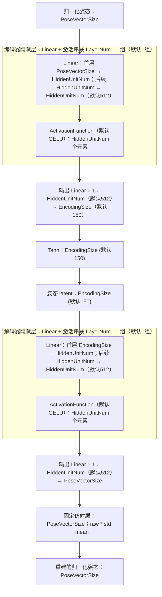
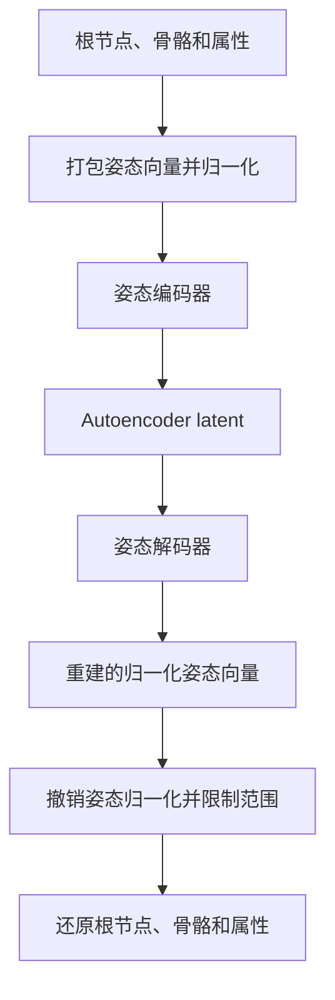

# Autoencoder：推理与训练

[English](train-autoencoder-workflow.md) | 中文

Autoencoder 将完整姿态压缩为潜在向量（latent），再从 latent 重建姿态。应先训练 Autoencoder，再训练 [Controller](train-controller-workflow.zh-CN.md)：Controller 训练时用它的编码器准备姿态数据集，运行时用它的解码器生成动画。

下文用 `P` 表示姿态向量维度，`D` 表示 latent 维度，`B` 表示 batch 大小。姿态向量按照固定布局，包含资产选定的根节点、骨骼和属性通道。

## 每个网络的输入和输出

| 网络 | 输入及其来源 | 输出及其用途 |
| --- | --- | --- |
| 姿态编码器 | `[B, P]` 归一化姿态向量；训练时从数据库帧提取，运行时来自初始化姿态 | `[B, D]` latent，经过末尾的 `Tanh` 限制范围；送入解码器重建，或进一步归一化供 Controller 使用 |
| 姿态解码器 | `[B, D]` latent；Autoencoder 训练时来自编码器，运行时来自撤销 Controller 归一化后的生成结果 | `[B, P]` 重建的归一化姿态向量；与训练姿态比较，或还原成动画 |

两个网络都是前馈 MLP，每次处理一个姿态。训练时相邻帧提供时间上的监督，但单次网络输入是一个姿态，并不是一段序列。

## 网络结构：逐层维度与连接

下图表示可配置结构：`EncodingSize`（默认150）、`HiddenUnitNum`（默认512）、`LayerNum`（默认2）、`ActivationFunction`（默认GELU）。`PoseVectorSize` 取决于选中的姿态通道。每个重复单元包含一个 Linear 和一个激活层；重复表示多个参数独立的层依次串联，不是循环调用同一个共享权重的层。

图中数字是单个样本的元素数，不是参数数量。例如宽度 `512` 在 batch 中对应 `[B, 512]`。`Linear(a → b)` 表示全连接：每个输出使用全部 `a` 个输入并加偏置，共产生 `b` 个输出。激活层保持维度不变。



一般情况下，`LayerNum = L` 表示每个网络的线性层总数：`L - 1` 个隐藏线性层各接激活，再接一个输出线性层。编码器为 `P → H → ... → H → D → Tanh`，解码器为 `D → H → ... → H → P → affine`。若 `L = 1`，输入直接投影到输出，不经过隐藏层。

| 层类型 | 编码器数量 | 解码器数量 |
| --- | --- | --- |
| 隐藏 Linear + 激活组合 | `LayerNum - 1`（默认1组） | `LayerNum - 1`（默认1组） |
| 输出 Linear | 1 | 1 |
| Linear 总数 | `LayerNum`（默认2） | `LayerNum`（默认2） |
| 最终变换 | 1 个 Tanh | 1 个固定仿射层 |

这里没有残差连接，也没有 LayerNorm。隐藏激活可以是 GELU、ReLU、ELU 或 Tanh；编码器末尾始终额外保留 Tanh。解码器输出线性层后没有非线性激活，其末尾仿射参数在训练时被冻结。资产层面的姿态归一化与反归一化位于图中网络之外。

## 推理：编码姿态，再还原动画



编码姿态时，必须使用资产保存的骨骼选择、属性布局和归一化参数。UE 用 `ToPoseVectors` 打包姿态数据；初始化 Controller 状态时，还会限制向量范围，然后调用 `NormalizePoseVectors` 并执行编码器。

解码时，先执行解码器，再调用 `DenormalizePoseVectors`、限制结果范围，最后通过 `FromPoseVectors` 还原姿态。运行时还原还需要组件的位置和旋转，以便在对应参考坐标系中解释姿态。动画节点据此输出骨骼、根运动和配置的属性。

这里有两层归一化：

- **Autoencoder 姿态归一化**使用资产的 `PoseVectorOffset` 和 `PoseVectorScale`。在编码器之前应用，在解码器之后撤销。
- **Controller latent 归一化**将编码器输出转换到 Controller 使用的空间。Controller 生成的 latent 必须先撤销这一层归一化，才能送入解码器。

解码器末尾还有一个仿射层，其统计量来自已经归一化的训练姿态。因此解码器输出仍然是归一化姿态向量，该层不能代替资产层面的姿态反归一化。

在 Controller 动画节点中，姿态状态重置时，会根据可用的姿态历史或资产默认值，通过姿态编码器初始化 latent。正常生成时直接维护当前 latent，并在每次更新时解码，不会把每个解码后的姿态重新编码。

## 训练：UE 准备数据集

1. 选择数据库中的帧区间，以及要编码的骨骼和属性。
2. 将选中的帧提取为扁平姿态向量。
3. 拟合并保存姿态归一化参数，然后原地归一化这些向量。
4. 根据姿态权重设置，计算每个坐标的重建权重。
5. 在 C++ 中构建编码器和解码器。编码器以 `Tanh` 结尾，解码器以之前介绍的仿射层结尾。
6. 将数据和初始网络快照写入共享内存，启动 `train_autoencoder.py <config.json>`。

| 共享内存字段 | 形状 / 类型 | 来源和用途 |
| --- | --- | --- |
| `PoseVectorsGuid` | `[TotalFrameNum, P]`，`float32` | 归一化后的数据库姿态，同时作为编码器输入和重建目标 |
| `PoseVectorWeightsGuid` | `[P]`，`float32` | C++ 计算的坐标权重，用于姿态和运动重建损失 |
| `RangeStartsGuid` | `[RangeNum]`，`int32` | 每个动画区间在姿态数组中的起点 |
| `RangeLengthsGuid` | `[RangeNum]`，`int32` | 区间长度，用于避免采样的相邻帧跨越区间边界 |
| `EncoderGuid`、`DecoderGuid` | 独立的 `uint8` 快照 | 初始网络结构和参数；同一缓冲区也用于返回训练后的网络 |

JSON 提供共享内存标识、维度和训练设置。Python 用 `SharedMemory(..., create=False)` 打开已有内存，再用 `np.frombuffer` 创建 NumPy 视图。之后将完整姿态数组复制到锁页 CPU 内存（pinned memory），并将采样的 batch 传到训练设备。数据集在启动前就已准备好，UE 不会在训练过程中逐个发送 batch。

## 训练：前向计算与监督目标

Python 加载传入的网络，并冻结解码器末尾仿射层的统计参数。它枚举每个区间内所有相邻的两帧窗口，每次迭代随机采样 `B` 个窗口。

```text
数据库姿态对 x              [B, 2, P]
    -> 合并 batch 和时间维度 [2B, P]
    -> 姿态编码器           [2B, D]
    -> 姿态解码器           [2B, P]
    -> 恢复时间维度         [B, 2, P]
重建姿态对 x_hat
```

解码器的目标就是原始的归一化姿态对。训练没有预先提供 latent 标签，编码器通过重建损失和 latent 正则项学习表示。

记 `z` 为编码后的姿态对，`w` 为坐标权重，`delta(v) = (v[:, 1] - v[:, 0]) / DeltaTime`。

| 损失 | 计算方式 | 目标来源 |
| --- | --- | --- |
| 姿态重建 | `0.2 * mean(w * abs(x - x_hat))` | 原始数据库姿态 |
| 运动重建 | `0.01 * mean(w * abs(delta(x) - delta(x_hat)))` | 数据库中相邻姿态的变化 |
| Latent 幅度 | `0.001 * mean(abs(z))` | 正则项，鼓励较小的 latent 数值 |
| Latent 平滑性 | `0.001 * mean(abs(delta(z)))` | 正则项，鼓励相邻帧具有相近的 latent |

每次迭代将这些损失相加，用 AdamW 联合更新两个网络。学习率在设定的迭代次数内先预热再衰减。时间相关损失鼓励运动平滑，同时保留单姿态推理方式。

## 训练结果如何使用

Python 定期将编码器和解码器快照写入共享内存，并设置就绪标志。UE 加载快照后清除标志，允许下一次写入。训练结束时还会发布最终快照。

训练后的资产保存编码器、解码器、姿态布局和推理所需的归一化参数。接下来训练 Controller 时，用该编码器处理数据库姿态，生成 latent 姿态数据集。整个 Controller 训练过程中，Autoencoder 的两个网络都保持固定。
