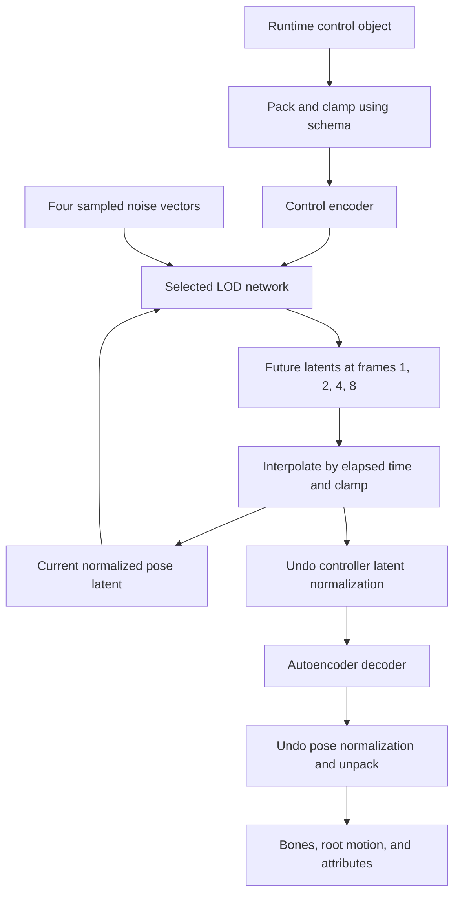

# Controller: inference and training

English | [中文](train-controller-workflow.zh-CN.md)

The controller generates future pose latents from a current pose, behavior controls, and random noise. It first trains a flow-matching teacher together with a control encoder, then distills the teacher into three LOD networks. Runtime uses the control encoder, one selected LOD network, and the [autoencoder decoder](train-autoencoder-workflow.md).

Let `D` be the pose-latent size, `C` the control-vector size, `E` the encoded-control size, and `B` the batch size. Controller pose values below are in **controller-normalized latent space**, unless stated otherwise.

## Network inputs and outputs

| Network | Input and its source | Output and its use | When trained |
| --- | --- | --- | --- |
| Autoencoder pose encoder | Normalized full poses from database frames or the runtime initialization pose | `[B, D]` autoencoder latents; normalized for controller use | Earlier autoencoder training |
| Control encoder (`controller_network`) | `[B, C]` vectors packed from training or runtime control objects using the control schema | `[B, E]` conditioning features for the teacher and LODs | With the teacher |
| Teacher (`denoiser_network`) | Previous pose `[B, D]`, intermediate future block `[B, 4D]`, flow time `[B, 1]`, encoded controls `[B, E]` | `[B, 4D]` flow velocity; integrated to generate distillation targets | First controller stage |
| LOD0, LOD1, LOD2 | Previous pose `[B, D]`, initial noise `[B, 4D]`, encoded controls `[B, E]` | `[B, 4D]` future latents at offsets `1, 2, 4, 8` frames | Second controller stage |
| Autoencoder pose decoder | Generated latent after undoing controller normalization | Normalized full pose; inverse pose normalization and unpacking produce animation | Earlier autoencoder training |

The control encoder's architecture comes from the observation schema. The teacher is a residual MLP created in Python. The LODs are C++-built residual MLPs with different capacities and identical input/output layouts. They are alternative generators, not a chain of three networks.

## Inference: controls to animation



1. **Initialize pose state.** On reset, the animation node builds pose data from available pose history, with asset defaults as fallback. It packs and normalizes the pose, evaluates the autoencoder encoder, then applies controller latent normalization and clamps the result. Later updates maintain the generated latent directly.
2. **Encode runtime controls.** The caller supplies a control object matching the controller schema. UE packs it into a vector, clamps it using the stored control distribution, and evaluates the control encoder. These values take the place of dataset controls used during training.
3. **Sample a future block when evaluation is due.** Sample four Gaussian noise vectors, clip them to `[-3, 3]`, and scale each latent dimension by `NormalizedPoseStds`. Concatenate `[current latent, four noise vectors, encoded controls]`, giving `5D + E` values.
4. **Evaluate one LOD.** The selected network predicts all four future latents in one forward pass. It takes no flow time and performs no teacher integration. `LODLevel` selects network capacity, not the time horizon.
5. **Advance the latent.** According to elapsed time and controller frame rate, UE moves toward the first prediction, then interpolates between predictions at frames `1, 2, 4, 8`. Beyond the last horizon it holds the final prediction. The clamped result becomes the current latent for subsequent generation.
6. **Decode animation.** Undo controller latent normalization, evaluate the autoencoder decoder, undo autoencoder pose normalization, clamp, and unpack the result into pose data. The animation node publishes bones, root motion, and configured attribute outputs.

The teacher is only used during training. The LODs replace its multi-step integration at runtime.

## Training: prepare paired poses and controls in UE

Use a trained autoencoder with the controller's database and behavior controls. The pose-data path is:

```text
Database frame -> full pose vector -> autoencoder pose normalization
    -> trained pose encoder -> latent z -> controller normalization -> X
```

Controller normalization subtracts per-dimension latent means and divides by one shared scalar: the average of the per-dimension latent standard deviations. UE stores these statistics and computes `NormalizedPoseStds` in the normalized space for noise scaling. This is separate from the autoencoder's full-pose normalization.

The control-data path is:

```text
Per-frame control objects in behavior control sets
    -> flatten using the control schema -> control vectors C
    -> record correspondence with database frames
```

Control and pose arrays can have different frame counts because several control ranges can refer to the same database animation. Three arrays align them: a start in each data array and a shared range length. For range `r` and local frame `j`:

```text
control = C[range_control_starts[r] + j]
pose    = X[range_encoded_starts[r] + j]
```

UE builds the control encoder and three LOD networks, writes the dataset and snapshots into shared memory, and starts `train_controller.py <config.json>`.

| Shared-memory field | Shape / type | What Python reads |
| --- | --- | --- |
| `EncodedVectorsGuid` | `[DatabaseTotalFrameNum, D]`, `float32` | Normalized pose latents `X` |
| `ControlVectorsGuid` | `[ControlTotalFrameNum, C]`, `float32` | Flattened behavior controls `C` |
| `RangeControlStartsGuid` | `[RangeNum]`, `int32` | Control-array offsets |
| `RangeEncodedStartsGuid` | `[RangeNum]`, `int32` | Corresponding pose-array offsets |
| `RangeLengthsGuid` | `[RangeNum]`, `int32` | Aligned range lengths |
| `ControllerGuid` | `uint8` snapshot | Initial control encoder |
| `LOD0Guid`, `LOD1Guid`, `LOD2Guid` | Separate `uint8` snapshots | Initial LOD networks |

JSON supplies identifiers, dimensions, schema, noise statistics, and settings. Python maps shared memory into NumPy views, copies pose/control arrays into pinned CPU memory, and transfers sampled batches to the training device. The full dataset is prepared before launch; JSON does not contain the arrays themselves.

Python initializes control normalization from the full control array and writes it into the schema-based control encoder. It creates a fresh teacher network. Neither autoencoder network is optimized by this script.

## Stage 1: train the teacher and control encoder

Python enumerates all nine-frame windows inside each aligned range. Each iteration randomly samples `B` windows. No window crosses a range boundary.

| Training value | Data source |
| --- | --- |
| Previous pose `p` | Window frame `0`, sometimes replaced by a random dataset pose, then perturbed with noise |
| Control `c` | Frame `0` of the aligned control window, with schema-aware noise added |
| Encoded control `e` | `control_encoder(c)`; there are no separate feature labels |
| Future target `y` | Dataset latents at offsets `1, 2, 4, 8`, flattened to `[B, 4D]` |
| Source noise `n` | Four clipped Gaussian latent vectors scaled by `NormalizedPoseStds` |
| Flow time `a` | Uniform random scalar in `[0, 1)` for each example |
| Intermediate future block `v` | `v = (1 - a) * n + a * y` |

The teacher takes `[p, v, a, e]`, with width `5D + 1 + E`, and predicts a vector of width `4D`:

```text
predicted_velocity = teacher(p, v, a, control_encoder(c))
target_velocity    = y - n
loss               = mean((predicted_velocity - target_velocity)^2)
```

This velocity describes movement along the noise-to-data path, not physical joint velocity. One teacher evaluation does not directly return the final future poses.

Backpropagation updates the teacher and control encoder jointly with AdamW. The control encoder learns conditioning features through this same loss rather than a separate supervised target.

## Stage 2: distill the teacher into three LODs

The teacher and control encoder now run without gradients. All three LOD networks learn against teacher-generated trajectories.

1. Sample a nine-frame control window and an initial dataset pose. In this stage, `RandomPoseSampleRate` is the probability of choosing the pose from the matching control window; otherwise it comes from an independently sampled window. Add pose and control perturbations.
2. Encode the full control window and sample a separate four-vector source-noise block for each rollout position.
3. Choose a rollout stride of `1`, `2`, `4`, or `8` frames with probabilities `0.70`, `0.15`, `0.10`, and `0.05`.
4. Generate a teacher target at each visited control position. Start with `v = n`. For `S = DenoiserSteps`, repeat `v = v + teacher(p_teacher, v, j/S, e) / S` for `j = 0 ... S-1`. The final `v` is the teacher's block of four future poses.
5. Evaluate each LOD once using `[its own previous pose, the same source noise, the same encoded controls]`. Each predicts a four-pose block directly.
6. Select the horizon matching the stride from each network's output and feed it back as that network's next previous pose. Advance the controls by the same stride and continue the rollout.

Teacher and students start from the same initial pose, but later follow their own predictions. Student feedback stays connected to the computation graph, so gradients pass through the rollout.

For each LOD, compare its output sequence `Y` with the teacher sequence `T`:

| Loss | Calculation | Target source |
| --- | --- | --- |
| Pose-block agreement | `0.1 * mean(abs(T - Y))` | Teacher-integrated blocks at each rollout position |
| Change over rollout | `0.002 * mean(abs(delta(T) - delta(Y)))` | Differences between successive teacher blocks divided by `stride * DeltaTime` |

The final distillation loss averages these six terms across the three students. The change term compares consecutive rollout positions, each containing a full four-pose block; it does not compare adjacent horizons within one block.

The dataset supplies starting poses and controls. The teacher supplies future-pose targets, including predictions extending beyond the sampled nine-frame window.

## Training outputs

Stage 1 publishes the trained control encoder. Stage 2 publishes all three LOD networks together. Python writes snapshots into shared memory and raises ready flags; UE loads the snapshots and clears those flags before the next publication. Final snapshots are published after training.

The runtime controller asset combines these four networks with the autoencoder reference, control schema, latent normalization, noise scales, and frame rate. The teacher stays in Python and is not part of the runtime inference chain.
