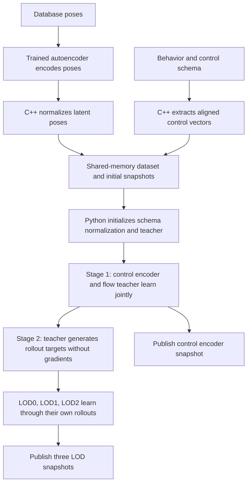

# Native AnimGen Controller: Network and Training Flow

This document describes the original `train_controller.py` and its C++ preparation code at Unreal Engine source revision `a899359c3efbaf38e491a7537148602cefde8e70`, inspected on 2026-09-11. It describes native behavior, not this repository's checkpoint variant or proposed remote service. The findings come from source inspection; no end-to-end training run is claimed.

The controller learns to generate future encoded poses conditioned on a previous pose and behavior controls. Training has two sequential stages: jointly train a control encoder and a flow-matching teacher, then distill that teacher into three smaller LOD networks. Runtime assets contain the control encoder and LOD students; the Python teacher is a training-only model.

## 1. End-to-end flow



Unreal launches `train_controller.py <config.json>`. The script loads four engine snapshots: a control encoder and three students. It creates a fresh PyTorch `DenoiserNetwork` for the teacher. The [autoencoder](train-autoencoder-workflow.md) has already encoded the dataset in C++; neither its encoder nor decoder is optimized by this script.

## 2. Data, alignment, and normalization

Let `D = PoseEncodingSize`, `C = ControlVectorSize`, `E = EncodedControlVectorSize`, `B = BatchSize`, and `dt = DeltaTime`. Here `X` denotes normalized **latent poses**, unlike the full pose vectors called `X` in autoencoder training.

| Input | Shape | Meaning |
| --- | --- | --- |
| Encoded vectors `X` | `[DatabaseTotalFrameNum, D]` | Normalized autoencoder outputs |
| Control vectors | `[ControlTotalFrameNum, C]` | Behavior observations in schema layout |
| Range control starts | `[RangeNum]` | Range offsets in the control array |
| Range encoded starts | `[RangeNum]` | Matching offsets in the encoded-pose array |
| Range lengths | `[RangeNum]` | Number of aligned frames per range |
| `NormalizedPoseStds` | `[D]` | Per-dimension latent noise scale |
| Control encoder and LOD snapshots | Separate byte arrays | C++-built architectures and initial parameters |

Data arrays use `float32`, range arrays use `int32`, and network snapshots use `uint8`. Control and pose frame counts can differ: several control ranges can reference the same database animation. The paired range offsets preserve alignment.

C++ converts database poses to the autoencoder's normalized pose-vector space and evaluates its encoder. It then computes per-dimension latent means and standard deviations. Controller normalization subtracts each dimension's mean and divides by a **single scalar**, the average of the per-dimension standard deviations. It does not independently standardize every latent dimension to unit variance. C++ recomputes `NormalizedPoseStds` in that normalized space and Python uses them to scale noise.

Python separately initializes control normalization from the full control array using `schema_annotate_normalization_observation(..., 0.001)` and `schema_write_norm_to_network`. Continuous-like schema fields can retain manual normalization or use shared, dimension-average, or per-dimension statistics. Learned statistics are embedded as affine transforms in the control encoder. Their parameters are not explicitly frozen during teacher training.

Both training stages use a hard-coded nine-frame window. Every valid start in a range of length at least nine contributes one aligned pose/control window. Sampling is uniform over those windows with replacement. Windows never cross range boundaries. Arrays remain in pinned host memory and sampled data is transferred to the training device.

## 3. Network architecture

### 3.1 Control encoder: schema-dependent conditioning

The variable `controller_network` represents the **control encoder**, mapping `[B,C] -> [B,E]`. It is constructed in C++ by `MakeEncoderNetworkModelBuilderElementFromSchema` and loaded from a snapshot.

Its topology depends on the behavior's observation schema; there is no single fixed hidden width or layer count for every controller. For example, leaf observations can use affine transforms, `And` combines child encodings, and an `Encoding` node applies an MLP to a child encoding. That node's MLP uses its own encoding size, activation, and `LayerNum + 1` linear layers, with activation on the final layer. Other composite schema types provide their corresponding structured operations.

The encoder receives noisy controls and learns jointly with the teacher in stage 1. In stage 2 its forward passes run under `torch.no_grad()`, so its parameters remain unchanged.

### 3.2 Teacher: residual MLP predicting flow velocity

The teacher input concatenates four values in a fixed order:

| Component | Width | Meaning |
| --- | --- | --- |
| Previous pose | `D` | Noisy conditioning pose |
| Intermediate future-pose block | `4D` | Point on the noise-to-data path |
| `alpha` | 1 | Scalar flow time |
| Encoded controls | `E` | Output of the control encoder |
| **Total input** | **`5D + 1 + E`** | |
| **Output** | **`4D`** | Predicted flow velocity for four future poses |

For hidden width `H` and `DenoiserLayerNum = L`, its structure is:

```text
input -> Linear(5D+1+E, H) -> LayerNorm -> GELU
      -> (L-1) residual blocks: h = h + GELU(LayerNorm(Linear(H,H)(h)))
      -> Linear(H, 4D)
```

Thus the teacher has `L` hidden transformations plus one output linear layer: `L + 1` linear layers in total. The editor defaults are `H=1792`, `L=10`, giving nine residual blocks and eleven linear layers. The Python class signature has fallback defaults of 2048 and 12, but the launch config explicitly overrides them. Teacher activation is always GELU; it does not read the configurable LOD activation. Flow time is supplied directly as a scalar, without a separate time-embedding network.

### 3.3 LOD students: direct generation in one network evaluation

Each student consumes `[previous pose (D), initial noise (4D), encoded controls (E)]` and directly predicts four future normalized latent poses. Its input width is `5D+E`, and its output width is `4D`. There is no `alpha` input and no iterative flow integration inside a student evaluation.

C++ constructs each student using `MakeResidualMLPWithLayerNorm`, followed by a `Denormalize` affine layer:

```text
input -> Linear(5D+E, H) -> activation
      -> (L-2) residual blocks: h = h + activation(LayerNorm(Linear(H,H)(h)))
      -> Linear(H, 4D) -> output * scale + offset
```

Unlike the teacher, the student's first projection has **no LayerNorm**, and its `LOD*LayerNum = L` includes the output linear layer.

| Student | Default hidden width | Total linear layers | Residual blocks |
| --- | --- | --- | --- |
| LOD0 | 1024 | 8 | 6 |
| LOD1 | 512 | 6 | 4 |
| LOD2 | 256 | 4 | 2 |

The final affine layer starts with zero offsets and four repetitions of `NormalizedPoseStds` as scales. Unlike the autoencoder decoder's final layer, these parameters are not frozen and are included in student optimization. This layer scales outputs within controller latent space; it is not the conversion back to the autoencoder's original latent space.

Students default to GELU, compressed linear layers, and Kaiming uniform initialization. These settings come from C++, while the teacher uses PyTorch's ordinary linear layers and initialization. All three students learn from the same teacher directly; LOD1 is not distilled from LOD0, and LOD2 is not distilled from LOD1.

## 4. Stage 1: conditional flow matching

### 4.1 Select targets and perturb conditioning

Each iteration samples `B` nine-frame windows. It takes the control vector from window frame zero and the four target poses at offsets **1, 2, 4, and 8**, then flattens those targets into `y` of shape `[B,4D]`.

Let `s = NormalizedPoseStds`, with broadcasting across pose blocks. The script builds:

- Source noise `n`: four independent Gaussian pose blocks, clipped to `[-3,3]` before multiplication by `s`.
- Previous pose `p`: frame zero, replaced by a random pose sampled from the entire encoded dataset with probability `RandomPoseSampleRate`, then perturbed by pose noise.
- Pose noise: a per-sample uniform amplitude times `PoseNoiseScale * s * clipped_gaussian`.
- Noisy controls `c`: frame-zero controls plus a per-sample uniform amplitude times `ControlNoiseScale * clipped_gaussian`, multiplied by the schema noise mask and scales.

The schema noise mask preserves discrete fields and respects structured observations; continuous fields receive scaled noise. These perturbations expose the teacher to imperfect previous poses and controls.

### 4.2 Learn a velocity field

Sample `alpha` uniformly in `[0,1)` for each example and interpolate:

```text
x_alpha = (1 - alpha) * n + alpha * y
target_velocity = y - n
predicted_velocity = teacher(concat(p, x_alpha, alpha, control_encoder(c)))
L_flow = mean((predicted_velocity - target_velocity)^2)
```

The teacher predicts the velocity along a noise-to-data path. It does not directly regress the clean pose in this stage. A single sampled flow time and one teacher evaluation are used per training example; `DenoiserSteps` is not the number of teacher evaluations in a stage-1 update.

One AdamW optimizer updates both teacher and control encoder. The students are not updated during this stage. There is no decoder-space pose loss or gradient through the autoencoder.

## 5. Stage 2: distillation with autoregressive rollouts

### 5.1 Prepare rollout conditions

Each iteration independently samples control windows and candidate initial-pose windows. The native selection expression chooses the pose associated with the control window when a uniform draw is below `RandomPoseSampleRate`; otherwise it chooses an independent random window.

This direction differs from stage 1: with the default rate `0.1`, stage 1 explicitly substitutes a random pose about 10% of the time, while stage 2 explicitly selects the aligned pose about 10% of the time. Independent random sampling can also coincidentally choose an aligned window. This documents the implementation as written rather than interpreting the setting name as identical behavior in both stages.

The script adds noise to the initial pose and to all nine control frames, then encodes all controls without gradients. It samples fresh source-noise blocks of shape `[B,9,4D]`, shared by teacher and students at each rollout position.

One output horizon is selected for the whole batch:

| Selected output index | Frame skip `k` | Probability | Control positions visited | Rollout length |
| --- | --- | --- | --- | --- |
| 0 | 1 | 0.70 | 0 through 8 | 9 |
| 1 | 2 | 0.15 | 0, 2, 4, 6, 8 | 5 |
| 2 | 4 | 0.10 | 0, 4, 8 | 3 |
| 3 | 8 | 0.05 | 0, 8 | 2 |

At every visited position, each network still predicts **all four** future horizons. The chosen horizon only determines the pose fed into the next rollout step and the control-frame stride.

### 5.2 Generate teacher and student trajectories

Teacher and students start from the same noisy initial pose. At each visited control position, the teacher begins at that position's source noise `v_0 = n` and performs `S = DenoiserSteps` explicit Euler steps:

```text
alpha_j = j / S, for j = 0, ..., S-1
v_(j+1) = v_j + teacher(concat(previous_teacher_pose, v_j, alpha_j, controls)) / S
teacher_target = v_S
```

The default `S=4` evaluates the teacher at flow times 0, 0.25, 0.5, and 0.75. The previous pose and encoded controls are held fixed during those four integration steps.

Each student makes one forward pass using its own previous pose, the same source noise, and the same encoded controls. Teacher and student outputs are collected, and each network's selected horizon becomes **its own** next pose. Students therefore encounter their own accumulated errors instead of receiving the teacher's previous pose at every step.

Teacher integration and control encoding use `torch.no_grad()`. Student feedback is not detached, so backpropagation passes through the entire sampled student rollout. This is temporal unrolling of feed-forward networks through their pose feedback, rather than a separate recurrent cell.

For a rollout length `R`, target and student output tensors have shape `[B,R,4D]`. Teacher compute is `R*S` forward evaluations per iteration; each student performs `R` evaluations. Even late rollout predictions are supervised by teacher output, without requiring corresponding ground-truth frames beyond the sampled window.

### 5.3 Distillation losses

For each student `l`, let `T` be the teacher output sequence, `Y_l` the student output sequence, and `k` the chosen frame skip:

```text
L_pose_l = 0.1 * mean(abs(T - Y_l))
V_T     = (T[:,1:] - T[:,:-1]) / (k * dt)
V_l     = (Y_l[:,1:] - Y_l[:,:-1]) / (k * dt)
L_vel_l = 0.002 * mean(abs(V_T - V_l))

L_distill = (L_pose_0 + L_pose_1 + L_pose_2
           + L_vel_0 + L_vel_1 + L_vel_2) / 6
```

The velocity differences compare consecutive rollout predictions of the full four-horizon block. They do not compare horizon 1 with horizon 2 inside a single output. All three students are optimized together using this six-term average. Distillation targets are the teacher's generated trajectories, not the dataset's original future poses.

## 6. Optimizers and native defaults

There are two independent AdamW optimizers: one for teacher plus control encoder, and one for all three students. Both explicitly set `amsgrad=True` and the configured learning rate; other AdamW arguments retain the installed PyTorch defaults. There is no gradient clipping in the native loops.

Each optimizer has its own scheduler and warmup. For its stage budget `N`:

```text
lr(i) = LearningRate * min(i / WarmupIterations, 1)
                     * (1 - clip(i / N, 0, 1))
```

The scheduler starts at zero and advances after optimizer updates. Student learning-rate progress starts independently when distillation begins.

| JSON setting | C++ default | Meaning |
| --- | --- | --- |
| `IterationNum` | 500,000 | Teacher/control-encoder iterations |
| `IterationDistillNum` | 200,000 | Joint student iterations |
| `BatchSize` | 512 | Examples per iteration |
| `LearningRate` | 0.001 | Base learning rate for both stages |
| `WarmupIterations` | 1,000 | Warmup for each stage |
| `DenoiserSteps` | 4 | Teacher Euler steps per rollout position |
| `PoseNoiseScale` | 0.1 | Previous-pose perturbation |
| `ControlNoiseScale` | 0.01 | Control perturbation |
| `RandomPoseSampleRate` | 0.1 | Stage-specific initial-pose selection described above |
| `Seed` | 1234 | Python, NumPy, and PyTorch seed |

Asset settings and launch JSON override these defaults. Python sets one PyTorch CPU thread and uses the requested CUDA device when available, otherwise CPU. The script has no validation split, early stopping, or best-model selection. It runs the configured teacher budget followed by the configured distillation budget.

## 7. Publication, logging, and cancellation

The shared-memory control array has seven `int32` entries:

| Index | Meaning |
| --- | --- |
| 0 | Exit request, cleared when observed |
| 1 | Teacher-stage iteration |
| 2 | Distillation iteration |
| 3 | Rolling flow loss multiplied by 100,000 |
| 4 | Rolling distillation loss multiplied by 100,000 |
| 5 | Control encoder snapshot ready |
| 6 | All three LOD snapshots ready |

Each stage maintains a separate exponential moving average with weights 0.99 for the previous average and 0.01 for the new loss. Every 1,000 iterations, including iteration zero after its update, stage 1 publishes the control encoder if its flag is clear, and stage 2 publishes all three students if their shared flag is clear. The teacher is never published to Unreal.

After stage 1, Python waits for a previous control-encoder publication to be consumed and publishes its final encoder. After stage 2, it resets both iteration counters, waits for a previous LOD publication to be consumed, writes all three final snapshots, and raises their shared flag. It does not explicitly wait for acknowledgement of the newly published final LOD snapshots before returning.

An exit request in stage 1 sets an `exiting` flag that skips distillation, but the script still follows its final publication paths, including publishing the current student snapshots. An exit request in stage 2 breaks its loop and publishes the current students. Final publication wait loops do not poll exit requests or enforce a timeout; the stronger cancellation contract in the [remote architecture](../docs/remote-training-architecture.md) is a proposed bridge requirement.

The native script writes a `config.json` into its run directory and emits TensorBoard metrics when TensorBoard imports successfully. Unlike the autoencoder script, the controller script does not consult `EnableTensorboard`. Metrics include flow loss, each student's pose/velocity losses, the combined distillation loss, and both learning rates. The writer is flushed and closed at the end.

Despite the variable name `snapshots_dir`, the original script does not save a resumable teacher/optimizer checkpoint there. Its config and TensorBoard logs cannot restore stage-1 training state. The repository's [checkpoint variant](../animgen_checkpoint/README.md) adds separate behavior and should not be confused with this native workflow.

## 8. Source map

All paths below are relative to the external Unreal Engine root.

| Source | Relevant responsibility |
| --- | --- |
| `Engine/Plugins/Experimental/Animation/AnimGen/Content/Python/train_controller.py` | Teacher class, flow objective, noise sampling, rollout distillation, publication |
| `Engine/Plugins/Experimental/Animation/AnimGen/Source/AnimGenEditor/Private/AnimGenEditorControllerToolkit.cpp` | Pose/control preparation, latent statistics, schema encoder and student construction, launch configuration |
| `Engine/Plugins/Experimental/Animation/AnimGen/Source/AnimGen/Public/AnimGenController.h` | Training and network defaults |
| `Engine/Plugins/Experimental/Animation/AnimGen/Source/AnimGen/Private/AnimGenController.cpp` | Latent normalization and inverse normalization |
| `Engine/Plugins/Experimental/LearningCore/Source/Learning/Private/LearningObservation.cpp` | Schema-dependent control encoder construction |
| `Engine/Plugins/Experimental/LearningCore/Content/Python/learning_core/train_common.py` | Schema normalization, structured noise masks, snapshot helpers |
| `Engine/Plugins/Experimental/NNERuntimeBasicCpu/Source/NNERuntimeBasicCpu/Private/NNERuntimeBasicCpuModel.cpp` | Student residual-block layout and layer-count semantics |
| `Engine/Plugins/Experimental/NNERuntimeBasicCpu/Content/Python/nne_runtime_basic_cpu_pytorch.py` | Trainable affine parameters and loaded engine network modules |
