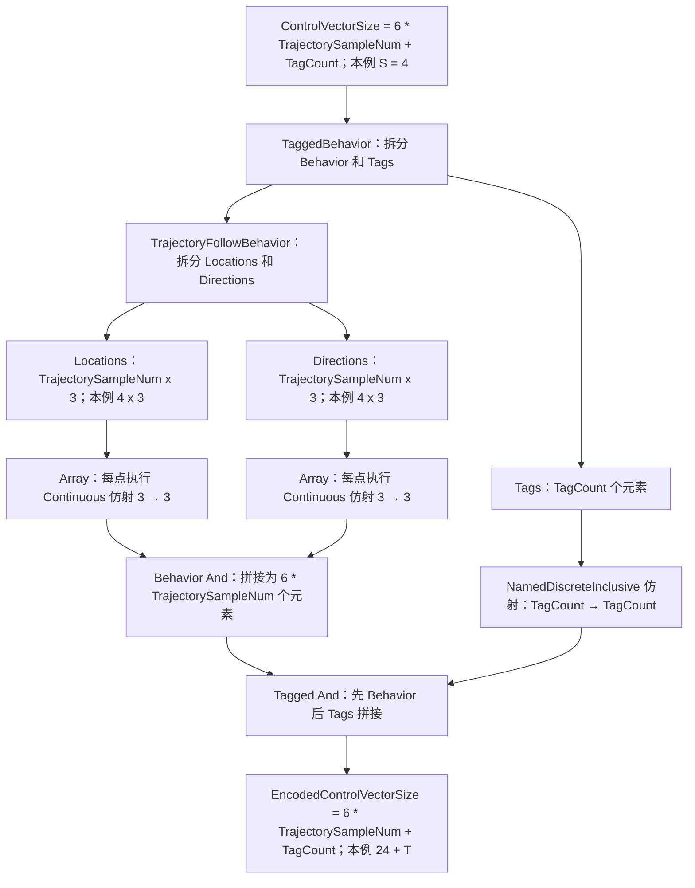
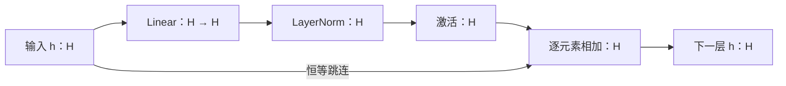
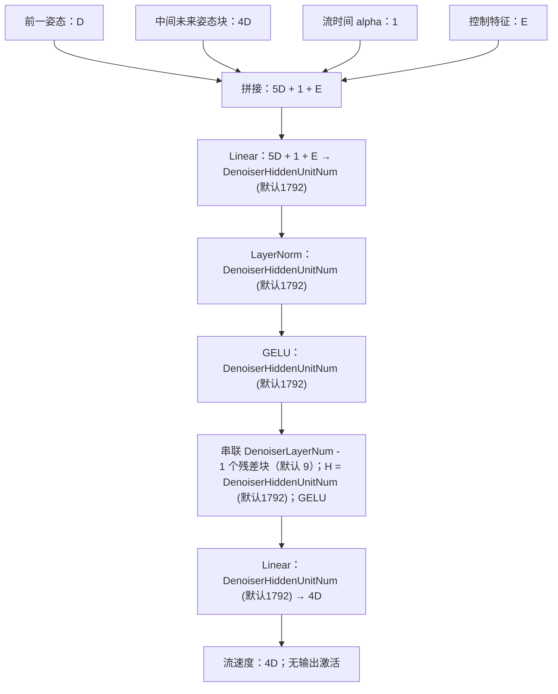
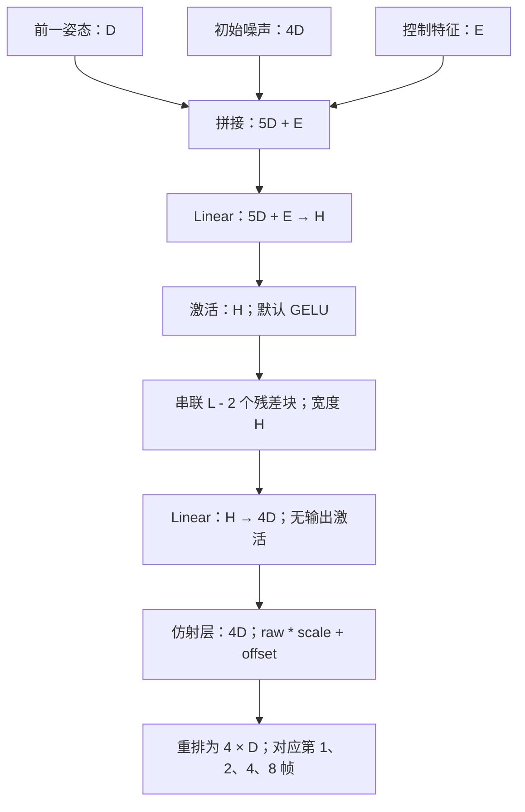
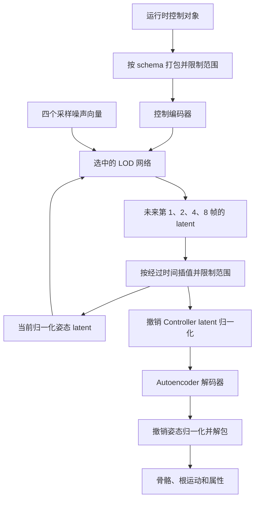

# Controller：推理与训练

[English](train-controller-workflow.md) | 中文

Controller 根据当前姿态、行为控制量和随机噪声生成未来姿态的 latent。训练先联合学习 Flow Matching 教师网络和控制编码器，再将教师蒸馏到三个 LOD 网络。运行时使用控制编码器、选中的一个 LOD 网络，以及 [Autoencoder 解码器](train-autoencoder-workflow.zh-CN.md)。

下文用 `D` 表示姿态 latent 维度，`C` 表示控制向量维度，`E` 表示编码后的控制特征维度，`B` 表示 batch 大小。除非另有说明，Controller 中的姿态值都处于 **Controller 归一化后的 latent 空间**。

## 每个网络的输入和输出

| 网络 | 输入及其来源 | 输出及其用途 | 何时训练 |
| --- | --- | --- | --- |
| Autoencoder 姿态编码器 | 来自数据库帧或运行时初始化姿态的归一化完整姿态 | `[B, D]` Autoencoder latent，进一步归一化供 Controller 使用 | 前置的 Autoencoder 训练 |
| 控制编码器（`controller_network`） | `[B, C]` 控制向量，由训练或运行时的控制对象按控制 schema 打包 | `[B, E]` 条件特征，提供给教师和 LOD 网络 | 与教师一起训练 |
| 教师网络（`denoiser_network`） | 前一姿态 `[B, D]`、中间未来姿态块 `[B, 4D]`、流时间 `[B, 1]`、控制特征 `[B, E]` | `[B, 4D]` 流速度，积分后生成蒸馏目标 | Controller 第一阶段 |
| LOD0、LOD1、LOD2 | 前一姿态 `[B, D]`、初始噪声 `[B, 4D]`、控制特征 `[B, E]` | `[B, 4D]` 未来 latent，对应偏移 `1、2、4、8` 帧 | Controller 第二阶段 |
| Autoencoder 姿态解码器 | 撤销 Controller 归一化后的生成 latent | 归一化完整姿态，经姿态反归一化和解包后生成动画 | 前置的 Autoencoder 训练 |

控制编码器的结构由观察 schema 决定。教师是在 Python 中创建的残差 MLP。LOD 网络是在 C++ 中构建的残差 MLP，容量不同，但输入输出布局相同。运行时从三个 LOD 中选一个使用，它们不串联执行。

## 网络结构：逐层维度与连接

图中缩写对应配置字段：`D = PoseEncodingSize`（来自 Autoencoder 的 `EncodingSize`，默认 150），`C = ControlVectorSize`，`E = EncodedControlVectorSize`（后两者由 schema 决定）。LOD 图中 `H = LODxHiddenUnitNum`，`L = LODxLayerNum`；各 LOD 的默认值见下表。

下面的维度是单个样本的元素数，不是参数数量；训练时宽度 `H` 对应 `[B, H]`。Linear 是全连接层，激活层和 LayerNorm 保持维度不变。姿态编码器和解码器的逐层结构参见 [Autoencoder 工作流](train-autoencoder-workflow.zh-CN.md#网络结构逐层维度与连接)。

### 控制编码器示例：TaggedBehavior 包含 TrajectoryFollowBehavior

使用一个 `TaggedBehavior`（`UAnimGenBehavior_Tagged`），其内部 `Behavior` 为 `TrajectoryFollowBehavior`（`UAnimGenBehavior_TrajectoryFollow`）。本例设置 `TrajectorySampleNum = 4`。记 `S = TrajectorySampleNum`，`T = TagCount`；其中 `TagCount` 指 `TagRanges` 中去重后的标签名数量，不是某一帧激活的标签数。

实际 schema 的嵌套和字段顺序如下：

```text
TaggedBehavior：Struct / And
├── Behavior：TrajectoryFollowBehavior：Struct / And
│   ├── Locations：Array(TrajectorySampleNum)，每项 Continuous(3)
│   └── Directions：Array(TrajectorySampleNum)，每项 Continuous(3)
└── Tags：NamedDiscreteInclusive(TagCount)
```

每个点提供三维位置和三维单位前向方向。“朝向”由 `Directions` 表示，不是四元数或三个欧拉角。运行时轨迹采样先用采样点的朝向旋转 `TrajectoryForwardVector`，再转换成相对根节点的方向；位置也转换到根节点的相对坐标系。这些点分布在配置的过去/未来时间区间内，不是 LOD 输出的第 `1、2、4、8` 帧。

| 输入字段 | 每个样本的元素数 | 本例四点时 |
| --- | --- | --- |
| `Behavior.Locations` | `3 * TrajectorySampleNum` | 12 |
| `Behavior.Directions` | `3 * TrajectorySampleNum` | 12 |
| `Tags` | `TagCount` | `T` 个 multi-hot 分量，允许多个标签同时激活 |
| 完整控制向量 | `ControlVectorSize = 6 * TrajectorySampleNum + TagCount` | `24 + T` |

展平顺序为 `[location_0, ..., location_(S-1), direction_0, ..., direction_(S-1), tags]`。所有位置组成一个数组，所有方向组成另一个数组，并不是每点的位置和方向交替排列。训练时从数据库轨迹和标签区间填充这些字段；运行时从期望轨迹和期望标签按相同 schema 填充。



**这个具体组合不会添加 MLP。** Continuous 和命名离散叶子编码器执行逐元素仿射变换；Array 将子编码器应用于数组元素；And 拼接各分支结果。因此本例中 `EncodedControlVectorSize = ControlVectorSize`。控制编码器包含 **0 个全连接 Linear 层、0 个 GELU 层、0 个残差块**。仿射变换使用逐元素尺度和偏置，不通过稠密矩阵混合所有坐标。Python 在训练前初始化 schema 归一化，编码器参数参与第一阶段教师训练的优化。

另外添加 `EncodedBehavior` 包装才会显式引入 `Encoding` MLP，本例不包含该包装。下文的 Teacher 和 LOD 仍然有自己的全连接层，四点配置下接收这里生成的 `24 + T` 维控制特征。

### 残差块

Teacher 和 LOD 的中间残差块使用以下连接方式：



计算为 `h_next = h + activation(LayerNorm(Linear(h)))`。两路各有 `H` 个元素，相加后仍为 `H`，不会拼接为 `2H`。重复串联的各残差块拥有独立参数。LayerNorm 在每个样本的隐藏特征维度上进行归一化。

### Teacher

下图使用编辑器默认值 `DenoiserHiddenUnitNum = 1792`、`DenoiserLayerNum = 10`，由启动配置传入 Python。



令 `L = DenoiserLayerNum`，则残差块数为 `L - 1`，线性层总数为 `L + 1`，所以**图中共有 11 个线性层**。输入投影和中间残差块都有 LayerNorm 和 GELU。流时间直接拼接，没有独立的时间嵌入网络。当 `D = 150` 时，输入宽度为 `751 + E`，输出宽度为 `600`。积分在网络外部执行。

### LOD0、LOD1 和 LOD2



输入投影后没有 LayerNorm。中间残差块使用前面的结构。`L = LODxLayerNum` 包括输入和输出投影，是全部线性层的数量。激活可配置，默认为 GELU。

| 网络 | 隐藏宽度 H | 线性层数 L | 残差块数 | 按执行顺序列出的投影 |
| --- | --- | --- | --- | --- |
| LOD0 | `LOD0HiddenUnitNum` (默认1024) | `LOD0LayerNum` (默认8) | `LOD0LayerNum - 2` (默认6) | `(5D + E) -> H`; `(H -> H)` x `(L - 2)`; `H -> 4D` |
| LOD1 | `LOD1HiddenUnitNum` (默认512) | `LOD1LayerNum` (默认6) | `LOD1LayerNum - 2` (默认4) | `(5D + E) -> H`; `(H -> H)` x `(L - 2)`; `H -> 4D` |
| LOD2 | `LOD2HiddenUnitNum` (默认256) | `LOD2LayerNum` (默认4) | `LOD2LayerNum - 2` (默认2) | `(5D + E) -> H`; `(H -> H)` x `(L - 2)`; `H -> 4D` |

这些是可覆盖的编辑器默认值。当 `D = 150` 时，输入宽度为 `750 + E`，输出为 `600` 个元素，重排成四个 150 维姿态。末尾仿射层初始偏置为零，尺度来自按四个时间点重复的 `NormalizedPoseStds`；脚本没有显式冻结该层参数。输出仍在 Controller 归一化 latent 空间中，运行时需要先撤销 Controller 归一化，再执行 Autoencoder 解码器。

## 推理：从控制量生成动画



1. **初始化姿态状态。** 重置时，动画节点根据可用的姿态历史构建姿态数据，缺失时使用资产默认值。将姿态打包、归一化并送入 Autoencoder 编码器，再执行 Controller latent 归一化和范围限制。后续更新直接维护生成的 latent。
2. **编码运行时控制量。** 调用方提供符合 Controller schema 的控制对象。UE 将其打包为向量，根据保存的控制分布限制范围，再执行控制编码器。这些运行时数据对应训练时的数据集控制量。
3. **需要重新生成时，采样未来姿态块的噪声。** 采样四个高斯噪声向量，裁剪到 `[-3, 3]`，再按 `NormalizedPoseStds` 缩放每个 latent 维度。拼接 `[当前 latent, 四个噪声向量, 控制特征]`，总维度为 `5D + E`。
4. **执行一个 LOD 网络。** 选中的网络一次前向计算输出全部四个未来 latent。它不接收流时间，也不执行教师积分。`LODLevel` 选择网络容量，而非预测时间跨度。
5. **推进当前 latent。** UE 根据经过时间和 Controller 帧率，先向第一个预测姿态靠近，再在第 `1、2、4、8` 帧预测之间插值。超过最后一个时间点则保持最后的预测。限制范围后的结果成为后续生成使用的当前 latent。
6. **解码动画。** 撤销 Controller latent 归一化，执行 Autoencoder 解码器，再撤销 Autoencoder 姿态归一化、限制范围并解包为姿态数据。动画节点输出骨骼、根运动和配置的属性。

教师仅用于训练。运行时由 LOD 的直接预测代替教师的多步积分。

## 训练：UE 准备对齐的姿态与控制数据

使用已经训练好的 Autoencoder，以及 Controller 的数据库和行为控制数据。姿态数据的处理链路是：

```text
数据库帧 -> 完整姿态向量 -> Autoencoder 姿态归一化
    -> 已训练的姿态编码器 -> latent z -> Controller 归一化 -> X
```

Controller 归一化先减去各 latent 维度的均值，再除以一个共享标量：各维度标准差的平均值。UE 保存这些统计量，并在归一化空间中计算 `NormalizedPoseStds`，用于缩放噪声。这与 Autoencoder 的完整姿态归一化是两回事。

控制数据的处理链路是：

```text
行为控制集中的逐帧控制对象
    -> 按控制 schema 展平 -> 控制向量 C
    -> 记录与数据库帧的对应关系
```

多个控制区间可以引用同一段数据库动画，因此控制数组与姿态数组的总帧数可能不同。通过三个数组将它们对齐：各自数组中的起点，以及共同的区间长度。对于区间 `r` 内的第 `j` 帧：

```text
control = C[range_control_starts[r] + j]
pose    = X[range_encoded_starts[r] + j]
```

UE 构建控制编码器和三个 LOD 网络，将数据集与快照写入共享内存，然后启动 `train_controller.py <config.json>`。

| 共享内存字段 | 形状 / 类型 | Python 读取的内容 |
| --- | --- | --- |
| `EncodedVectorsGuid` | `[DatabaseTotalFrameNum, D]`，`float32` | 归一化后的姿态 latent `X` |
| `ControlVectorsGuid` | `[ControlTotalFrameNum, C]`，`float32` | 展平的行为控制量 `C` |
| `RangeControlStartsGuid` | `[RangeNum]`，`int32` | 控制数组中的起点 |
| `RangeEncodedStartsGuid` | `[RangeNum]`，`int32` | 对应的姿态数组起点 |
| `RangeLengthsGuid` | `[RangeNum]`，`int32` | 对齐区间的长度 |
| `ControllerGuid` | `uint8` 快照 | 初始控制编码器 |
| `LOD0Guid`、`LOD1Guid`、`LOD2Guid` | 独立的 `uint8` 快照 | 初始 LOD 网络 |

JSON 提供标识、维度、schema、噪声统计量和设置。Python 将共享内存映射为 NumPy 视图，再将姿态和控制数组复制到锁页 CPU 内存，按采样 batch 传到训练设备。完整数据集在启动前已准备好，JSON 本身不包含这些数组。

Python 根据完整控制数组初始化控制归一化，并写入基于 schema 构建的控制编码器。同时创建一个新的教师网络。本脚本不会优化 Autoencoder 的任何网络。

## 第一阶段：联合训练教师和控制编码器

Python 枚举每个对齐区间内的所有九帧窗口，每次迭代随机采样 `B` 个窗口。窗口不会跨越区间边界。

| 训练量 | 数据来源 |
| --- | --- |
| 前一姿态 `p` | 窗口第 `0` 帧，有时替换为数据集中随机姿态，然后添加噪声扰动 |
| 控制量 `c` | 对齐控制窗口的第 `0` 帧，添加按 schema 处理的噪声 |
| 控制特征 `e` | `control_encoder(c)`，没有单独的特征标签 |
| 未来目标 `y` | 数据集内偏移 `1、2、4、8` 帧的 latent，展平为 `[B, 4D]` |
| 源噪声 `n` | 四个经过裁剪并按 `NormalizedPoseStds` 缩放的高斯 latent 向量 |
| 流时间 `a` | 每个样本独立采样的 `[0, 1)` 均匀随机标量 |
| 中间未来姿态块 `v` | `v = (1 - a) * n + a * y` |

教师接收 `[p, v, a, e]`，总维度为 `5D + 1 + E`，预测维度为 `4D` 的向量：

```text
predicted_velocity = teacher(p, v, a, control_encoder(c))
target_velocity    = y - n
loss               = mean((predicted_velocity - target_velocity)^2)
```

这里的速度表示从噪声到数据路径上的变化方向，不是物理关节速度。一次教师前向计算也不会直接返回最终未来姿态。

反向传播通过 AdamW 联合更新教师和控制编码器。控制编码器通过同一个损失学习条件特征，没有另设监督目标。

## 第二阶段：将教师蒸馏到三个 LOD

教师和控制编码器在此阶段不计算梯度。三个 LOD 网络一起学习教师生成的轨迹。

1. 采样一个九帧控制窗口和一个初始数据集姿态。在此阶段，`RandomPoseSampleRate` 表示从匹配控制窗口选取姿态的概率；否则从独立采样的窗口取姿态。随后添加姿态和控制扰动。
2. 编码整个控制窗口，并为每个轨迹展开位置分别采样一组包含四个向量的源噪声。
3. 按 `0.70、0.15、0.10、0.05` 的概率选择 `1、2、4、8` 帧的展开步长。
4. 在每个访问到的控制位置生成教师目标。从 `v = n` 开始，令 `S = DenoiserSteps`，对 `j = 0 ... S-1` 重复执行 `v = v + teacher(p_teacher, v, j/S, e) / S`。最终的 `v` 就是教师预测的四个未来姿态。
5. 每个 LOD 用 `[自己的前一姿态, 相同源噪声, 相同控制特征]` 执行一次前向计算，直接输出四个未来姿态。
6. 从每个网络的输出中选择与展开步长对应的时间点，将其反馈为该网络下一步的前一姿态。控制量也按相同步长前进，继续展开。

教师和学生从同一个初始姿态出发，但之后分别沿着自己的预测继续生成。学生的反馈仍连接在计算图上，因此梯度可以穿过整个展开过程。

对每个 LOD，比较其输出序列 `Y` 和教师序列 `T`：

| 损失 | 计算方式 | 目标来源 |
| --- | --- | --- |
| 姿态块一致性 | `0.1 * mean(abs(T - Y))` | 每个展开位置上由教师积分得到的姿态块 |
| 展开过程中的变化 | `0.002 * mean(abs(delta(T) - delta(Y)))` | 相邻教师姿态块的差值，除以 `stride * DeltaTime` |

最终蒸馏损失是三个学生共六个损失项的平均值。变化项比较的是相邻展开位置，每个位置都包含完整的四姿态块；并不是比较同一个块内相邻预测时间点。

这一阶段由数据集提供初始姿态和控制量，教师提供未来姿态目标，包括超出原始九帧窗口范围的预测。

## 训练结果如何使用

第一阶段发布训练后的控制编码器。第二阶段将三个 LOD 网络一起发布。Python 将快照写入共享内存并设置就绪标志，UE 加载后清除标志，允许下一次写入。训练结束时发布最终快照。

运行时 Controller 资产将这四个网络与 Autoencoder 引用、控制 schema、latent 归一化参数、噪声尺度和帧率组合使用。教师保留在 Python 训练侧，不属于运行时推理链路。
